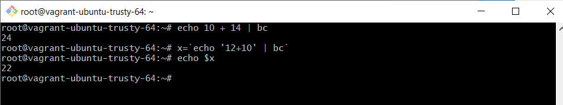
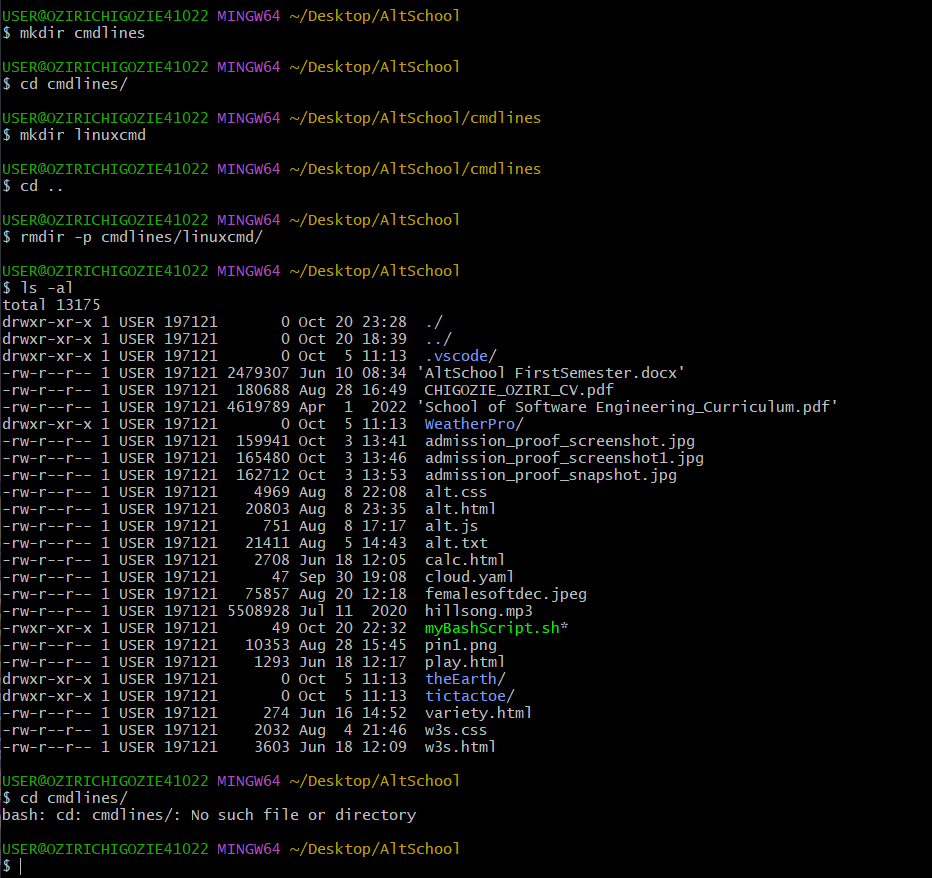
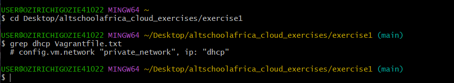
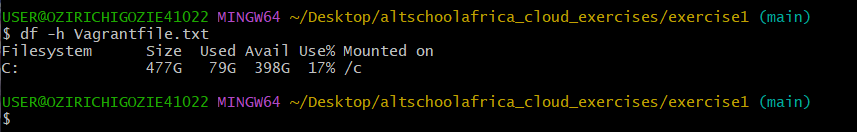
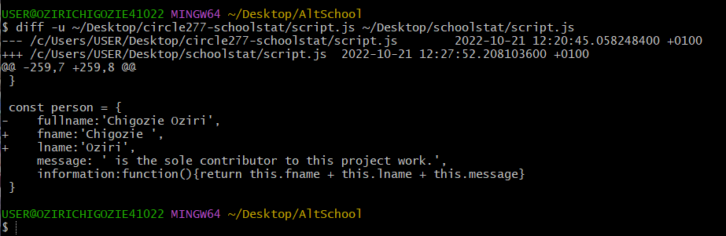
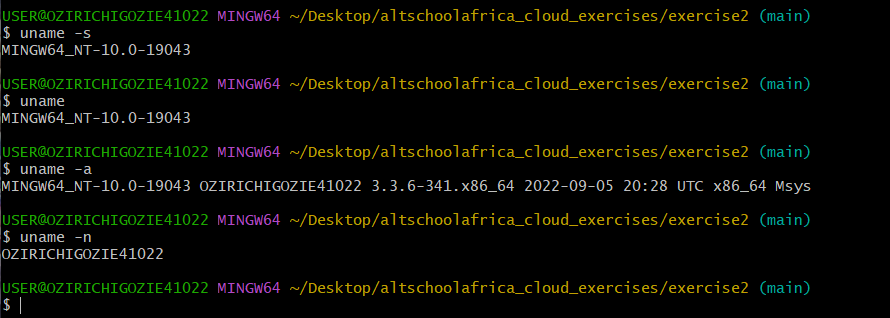
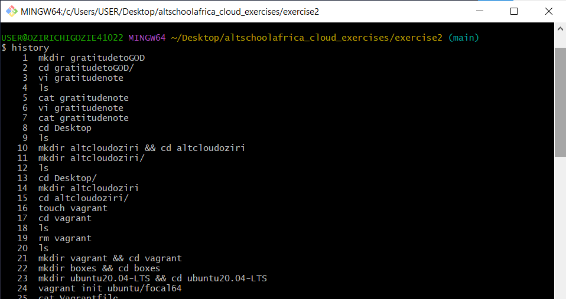
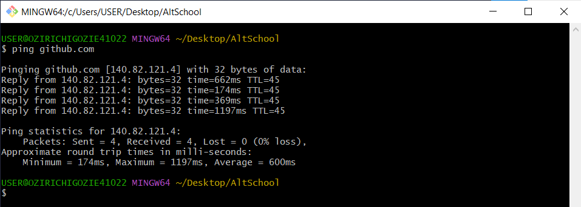
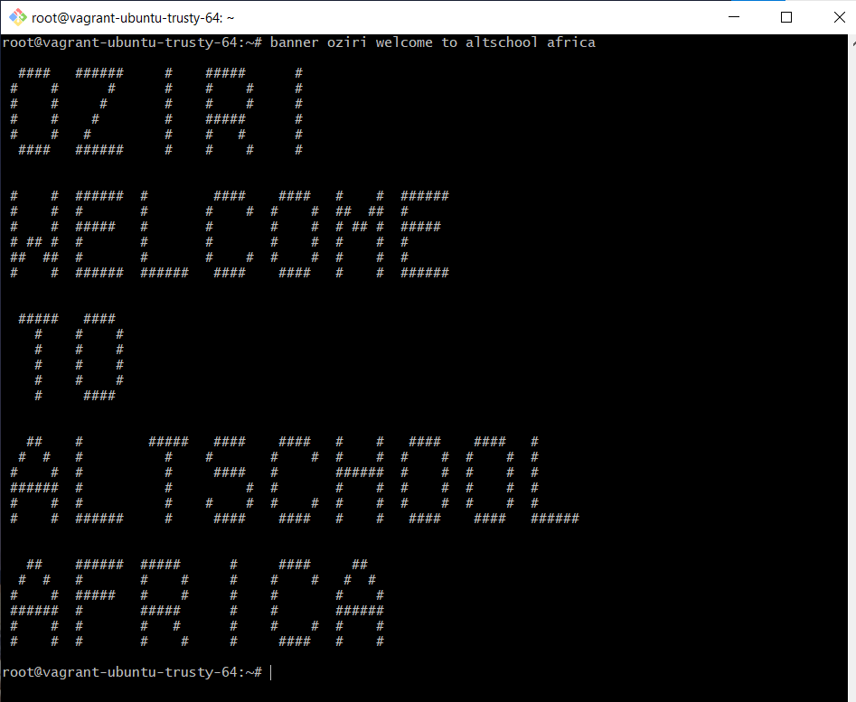

# Ten (10) Linux Command Lines

---

## 1. rmdir comman

## 10. bc command

The bc command is the calculator of the Command Line Interface.

>
>       echo yourCalculation | bc
>

For instance, `echo 14+10 | bc`

 

---

### NOTE:
>
>       **You have to install some of this commands using**
>
>       **sudo apt-get install commandName**
>
> **...as they may not be preinstalled in your Linux machine.**
>

## 10. bc command

The bc command is the calculator of the Command Line Interface.

>
>       echo yourCalculation | bc
>

For instance, `echo 14+10 | bc`

 

---

### NOTE:
>
>       **You have to install some of this commands using**
>
>       **sudo apt-get install commandName**
>
> **...as they may not be preinstalled in your Linux machine.**
>

This is used to delete an empty directory. It can also be used to delete an empty directory within another directory.

>
>	rmdir [option] nameOfEmptyDir
>

you may also run `rmdir [option] nameOfDir/nameOfEmptyDir`

---

## 2. grep command

This means global regular expression print. It is used for word search in a text file.  It returns the specific line containing the word being searched.

>
>	grep wordToBeSearched filename.txt
>

---

## 3. df command

This is used to display the system's disk space usage in KB, MB or GB and %.

>
>	df [option] filename
>

---

## 4. du command

Run the du command to find out how much space a specific file or directory occupies.

>
>	du [option] dir/filename.ext | du -h dirName | du -h filename.ext
>

### NOTE: 
>
> **ext indicates the extension of the particular file.**
>

---

## 5. diff command

The diff command compares two files and outputs the differences between both.

>
>	diff [option] file1 file2
>

It is mostly used to check the difference between two different versions of a particular source code.

---

## 6. uname command

Also known as Unix name displays kernel name, system's node hostname and other system info depending on the [option] you run as shown below.

>
>	uname [option]
>

---

## 7. history command

History command outputs the last 500 previously executed commands in your CLI.

>
>	history [option]
>

 

---

## 8. ping command

This is used for checking how reachable a network or server is, hence can be used in troubleshooting connectivity issues. It can be used thus, `ping website.domain`.   For example, you can run `ping google.com`.

 

---

## 9. banner command

This command is used to display text on the CLI in a sort of poster style.   The syntax is simply	`banner textToDisplay`.

 

---

## 10. bc command

The bc command is the calculator of the Command Line Interface.

>
>	echo yourCalculation | bc
>

For instance, `echo 14+10 | bc`

 

---

### NOTE:
>
>	**You have to install some of this commands using** 
>
>       sudo apt-get install commandName
>
> **...as they may not be preinstalled in your Linux machine.**
>

